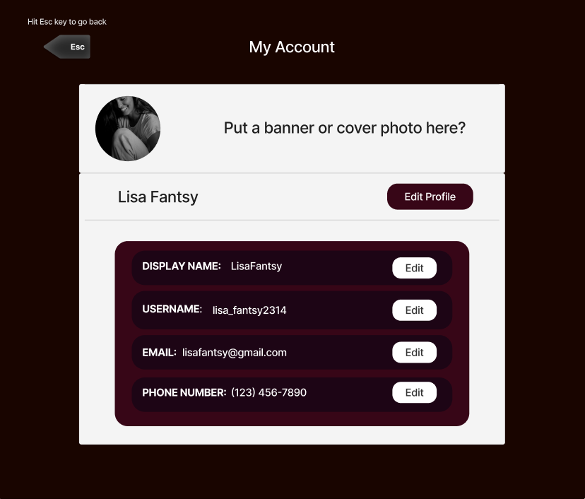

**Colors**  
  
Here are the hex codes from the left to the right:  
#020412 Use this as the main background color 
#1d0515 Use this for the background of the sidebar 
#370617 Use this for the main background of channel messages 
#510513 Use these as accents 
#6a040f Use these as accents 
#ffffff This one is white  
 
**User requirements**  
Authentication: New users can register, returning users can log in.  
Channel: Users can create channels and invite others to join them.  
Admin: Admins are special users with permissions to manage channels. Initially, the creator of a channel is its admin, they can make other users admins as well.  
Admins of channels will be able to manage them, including tasks such as removing members and deleting messages posted by others.  
Messaging: All users can send messages, either privately to another user or in a channel that they are a part of.  
Users: Users can update their personal information, such as their name, last name, bio, email address, etc.  
 
**Functional & Non-Functional requirements**  
**Functional requirements**  
Authentication: Users will be able to enter their personal information, the system will then store the information in the database for later use.  
The user can only be registered if their username is unique. That will serve as their key for other processes.  
Users will be able to enter their username and password, the system will check if that information matches anything in the database and grant access if so.  
 
Channel: In the backend the channels that have been created will be stored in the database with a unique key to identify it. The username of the users in the channel will be stored in the database.  
 
Admin: With the permission of being an admin granted to you, a user will be able to delete certain users and certain messages and promote other users to an admin.  
Their username will be stored in the database as an admin.  
 
Messages: All message history will be stored in the database  
 
Users: A user's personal information will be stored in the database, there will be code that connects to the database and updates a user's information if they choose to.  
The keys of the channels this user is a part of will also be stored in the database.  
 
**Non-Functional requirements**  
**Product requirement:**  
-There will be help menus to help users who are lost or new to the system.  
-System will be reliable; no crashing or wait times over a second.  
-System will be able to cater to users of different skill levels; for experts certain shortcuts will be provided and for novices tools and hints will be available.  
External requirement:  
-This web app will run on all major browsers on desktop  
-We will implement some safety features to protect users personal information in accordance to the levels of privacy expected by regulatory bodies.  

**Design**  
This is the design for the user profile page, users can view their current information then and make changes if necessary. 
  
This is the design for the channel page. All functionality is explained in the following annotations which can be better viewed through the following figma link [Figma design](https://www.figma.com/file/4kqgvEGAlwl8flLkyg1dJc/Untitled?type=design&node-id=0%3A1&mode=design&t=niq2g2iKaLOAK5XK-1).  
  

This is the design for the login and registration page where users can either sign into their GuildTalk account, or new users can create a new account.

